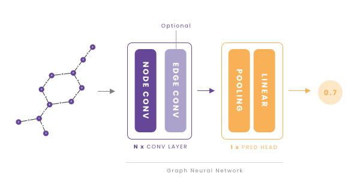
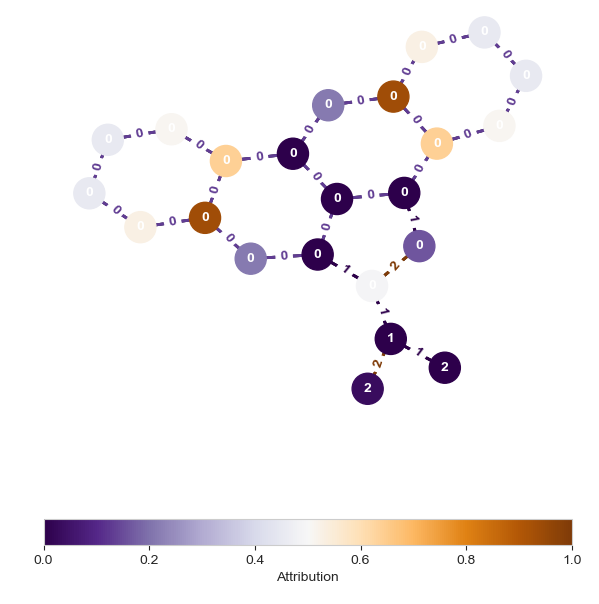

## 🔬 About
This report investigates the use of Graph Neural Networks (GNNs) 
for mutagenicity prediction of chemical compounds. 
The mutagenicity of a chemical compound is a binary attribute indicating whether 
the compound is likely to cause mutations in living organisms. In the context of drug discovery,
this is an important task that ensures the safety of newly developed drugs. 

On a high level, the prediction pipeline is described in the figure below.



In my code, I experiment with different types of node as well as edge convolutional layers. The experiment results suggest that global aggregation, i.e., taking into account all nodes/edges when computing given node's representation are more effective than local aggregation, i.e., taking into account only the node's neighbors. As part of interpretability of the model, I also used `Integrated Gradients` method to visualize how much each node/edge contributes to the final prediction.




Read more details in the [report](report.pdf) which describes the problem, the dataset, the model, and the results in detail.

## 🔮 Get started

### Virtual environment setup (optional)
We recommend using conda to manage your python environment. To create a new environment, run the following command:

```bash
conda create -n mutagenicity-prediction python=3.10
```

And then activate the environment:

```bash
conda activate mutagenicity-prediction
```

### Install required packages
To install the required packages, using `conda`, run the following command:

```bash
conda install --file requirements.txt
```

Otherwise, using `pip`, run the following command:

```bash
pip install -r requirements.txt
```